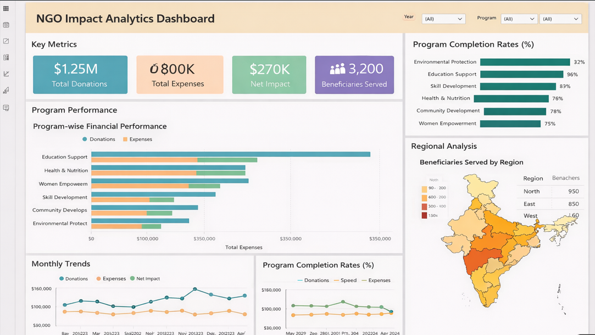

# NGO Impact Analytics

An end-to-end data analytics project designed to measure and visualize the financial and operational impact of NGO programs.  
The project demonstrates a complete analytics pipeline using **Python ETL**, **PostgreSQL**, **advanced SQL analytics**, and **Power BI**.

---

## 📌 Project Overview

This project simulates a real-world NGO analytics use case where multiple data sources are ingested, transformed, stored in a relational data warehouse, and analyzed to generate actionable insights.

The goal is to answer key business questions such as:
- How financially sustainable are NGO programs?
- Which programs deliver the highest impact per beneficiary?
- What are the completion and dropout rates across programs?
- How do donations and expenses trend over time?

---

##  Architecture
Raw CSV Data
↓
Python ETL (Extract → Transform → Load)
↓
PostgreSQL Data Warehouse (Star Schema)
↓
SQL Analytics & Views
↓
Power BI Dashboard

---

## 🗂️ Project Structure

---

NGO-Impact-Analytics/
│
├── etl/
│ ├── extract.py # Reads raw CSV data
│ ├── transform.py # Cleans and validates data
│ ├── load.py # Loads data into PostgreSQL
│ └── init.py
│
├── sql/
│ ├── schema.sql # Fact and dimension table definitions
│ ├── analysis.sql # Business and impact analysis queries
│ └── views.sql # Power BI–optimized SQL views
│
├── assets/
│ └── Powerbi_dashboard.png
│
├── config/
│ └── db_config.py # Database configuration (ignored)
│
├── requirements.txt
├── .gitignore
└── README.md

---

## 🧮 Data Model

The PostgreSQL database follows a **star schema** design:

### Dimensions
- `dim_programs`
- `dim_beneficiaries`

### Fact Tables
- `fact_donations`
- `fact_expenses`
- `fact_program_participation`

This structure enables efficient analytical queries and seamless BI integration.

---

## 🧪 ETL Pipeline

The ETL process is implemented in Python:

- **Extract:** Reads raw CSV files from the `data/raw` directory  
- **Transform:**  
  - Standardizes column names  
  - Removes invalid records  
  - Validates business rules (e.g., donation amounts, completion status)  
- **Load:** Loads clean data into PostgreSQL using SQLAlchemy

---

## 🧮 SQL Analytics

Advanced SQL queries were written to analyze:

- Total donations vs expenses (net impact)
- Program-wise financial performance
- Cost per beneficiary
- Program completion and dropout rates
- Monthly and month-over-month donation trends
- Data quality checks (orphan records)

---

## 📊 SQL Views (Power BI Layer)

To simplify BI consumption and avoid duplicated logic, key metrics were materialized as PostgreSQL views:

- `vw_program_financials`
- `vw_program_completion_rate`
- `vw_monthly_donations`

---

## 📊 Dashboard Preview (Power BI)

The Power BI dashboard connects directly to the PostgreSQL analytics views and provides an interactive summary of NGO impact.

**Key insights visualized:**
- Total Donations, Expenses, and Net Impact
- Program-wise Financial Performance
- Beneficiaries Served by Program
- Program Completion Rates
- Monthly Donation Trends

> Note: The dashboard is built on top of SQL analytics views.  
> The interactive Power BI (`.pbix`) file can be shared upon request.

---

## 🛠️ Tools & Technologies

- **Python** (Pandas, SQLAlchemy)
- **PostgreSQL**
- **Advanced SQL** (CTEs, window functions, aggregations)
- **Power BI**
- **Git & GitHub**

---

## 🎯 Key Learnings

- Built a complete ETL pipeline for analytics use cases
- Designed a star schema for analytical workloads
- Wrote production-style SQL analytics and views
- Integrated PostgreSQL with Power BI via ODBC
- Documented and structured a portfolio-ready analytics project

---

## 📌 Author

**Vijay Mukesh**  
Data Analytics | SQL | Python | Power BI  

